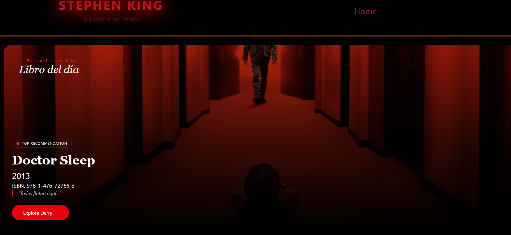

# Stephen King Api React



## Live Demo
[Api Stephen King React](https://apistephen.vercel.app/)

## Stack Tecnhologies
- Vite
- React
- Axios
- React Router
- Tailwind CSS
- Git

## Installation & Run
## Install Dependencies
```
npm install
```

## Run
```
npm run dev
```

## Estructura del proyecto

```
ApiStephenKingReact/
├── node_modules/ # Dependencias del proyecto
├── public/ # Archivos públicos (HTML, favicon, etc.)
├── src/ # Código fuente
│ ├── assets/ # Recursos como imágenes, estilos, fuentes
│ ├── components/ # Componentes reutilizables de React
│ │ ├── banner/
│ │ │ └── Banner.jsx
│ │ ├── library/
│ │ └── navbar/
│ │ ├── Navbar.jsx
│ │ └── Header.jsx
│ ├── data/ # Datos estáticos o de prueba
│ ├── pages/ # Páginas principales de la app
│ │ └── Home.jsx
│ ├── services/ # Llamadas a APIs y lógica de backend
│ │ └── stephenKingApi.js
│ ├── App.css # Estilos globales de la aplicación
│ ├── App.jsx # Componente raíz
│ ├── index.css # Estilos base
│ └── main.jsx # Punto de entrada de React
├── .gitignore # Archivos y carpetas ignoradas por git
├── eslint.config.js # Configuración de ESLint
├── index.html # HTML principal
├── package.json # Dependencias y scripts del proyecto
├── package-lock.json # Versionado de dependencias
├── README.md # Este archivo
└── vite.config.js # Configuración de Vite
```

## Author
Alberto Garcia Poncet